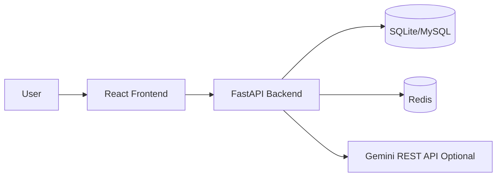

# Mindflow (Mini_ChatBot)

행동 로그를 기록하고, 감정/습관 패턴을 분석하며, AI 코치와 대화까지 이어지는 **FastAPI + React 풀스택 프로젝트**입니다.  
단순 CRUD 앱이 아니라, 백엔드 분석 엔진과 UI ViewModel API를 분리해 실제 서비스 형태에 가깝게 설계되어 있습니다.

---

## 1) 프로젝트 핵심 요약

- **문제 정의**: 사용자의 일상 행동/감정 데이터를 정리하고, 패턴 기반 인사이트를 제공.
- **핵심 가치**: 기록 → 분석 → 코칭의 선순환.
- **기술 특징**:
  - FastAPI + SQLAlchemy 기반 API 서버
  - JWT 인증 + 사용자 경로 권한 검증
  - 패턴 분석 서비스와 AI 피드백 서비스 분리
  - React(Vite) 기반 대시보드/분석/채팅/프로필 UI
  - Redis 캐시 및 채팅 rate-limit으로 운영 안정성 보강

---

## 2) 아키텍처 (심층)



### 백엔드 레이어 구조

1. **Router Layer (`backend/routers`)**  
   요청/응답, 인증 의존성, HTTP 예외 처리.
2. **Service Layer (`backend/services`)**  
   - `PatternAnalysisService`: 로그 기반 통계/추세/리스크 계산
   - `AIFeedbackService`: Gemini 호출 및 fallback 생성
3. **Model/Schema Layer**  
   SQLAlchemy ORM + Pydantic 응답 모델 분리.
4. **Infra Layer**  
   DB 엔진 fallback, Redis 캐시, 런타임 스키마 보정.

### 프론트엔드 구조

- `pages/`: 화면 단위 조합 (Dashboard, Analysis, Chat, Profile, Auth)
- `components/`: 재사용 UI/차트
- `api/api.js`: 토큰 주입 포함 API 호출 계층
- `hooks/useAppData.js`: 앱 초기 데이터 로딩 및 동기화
- `context/`: 테마/메시지/앱 설정 상태

---

## 3) 주요 백엔드 동작 분석

### 3-1. 앱 시작과 수명주기

`backend/main.py`의 lifespan에서 테이블 생성 및 활성 테이블 로깅을 수행합니다. 또한 CORS를 로컬 개발 포트(5173/5174) 기준으로 열어두고, `auth/users/behaviors/analysis/ui` 라우터를 등록합니다.

### 3-2. DB 연결 전략

`backend/database.py`는 `DATABASE_URL`의 1차 연결 실패 시(SQLite가 아닐 때) SQLite로 fallback하는 방식을 사용합니다.  
즉, MySQL 같은 외부 DB가 불안정해도 개발/데모 환경에서는 앱이 바로 죽지 않고 동작을 유지합니다.

추가로 startup 시 `run_schema_migrations()`에서 `users.password_hash` 컬럼 부재를 감지하면 `ALTER TABLE`을 시도합니다.

### 3-3. 인증/인가 모델

- 회원가입/로그인 시 access + refresh 토큰 발급
- `/api/auth/refresh`로 재발급
- 보호된 라우트에서 `require_same_user`로 URL `user_id`와 토큰 주체 일치 여부를 강제

이 구조 덕분에 "내 토큰으로 다른 사용자 경로 접근"을 백엔드 단에서 차단합니다.

### 3-4. 패턴 분석 엔진

`PatternAnalysisService`는 지정 기간 로그를 시간순으로 조회해 다음을 계산합니다.

1. **Behavior Patterns**: 감정별 빈도, 비율(%), 평균 강도
2. **Emotional Trends**: 감정별 강도 추세(increasing/decreasing/stable)
3. **Risky Patterns**:
   - 고비율/고강도 부정 감정
   - 연속 로그 간 강도 급변
   - 위험 태그(`self_harm`, `substance_abuse`, `suicidal_thoughts`) 포함 여부

분석 결과는 `/api/analysis/{user_id}` 뿐 아니라 UI 화면 데이터 구성에도 재사용됩니다.

### 3-5. AI 피드백 전략

`AIFeedbackService`는 Gemini를 **REST 직접 호출**합니다(SDK 의존성 회피 목적).  
`GOOGLE_API_KEY`가 없거나 호출 실패 시에도 fallback 문장을 생성하므로 서비스는 계속 동작합니다.

### 3-6. UI 전용 API 계층의 의미

`/api/ui/{user_id}/...`는 화면에서 필요한 데이터를 미리 조합해 반환합니다.

- `/overview`: 통계 카드 + 타임라인 + 감정 추세 + 최근 활동
- `/analysis`: 인사이트 + 분포 + 주간 패턴 + 추천
- `/profile`: 활동 지표 + 목표 + 성취 배지
- `/chat/bootstrap`, `/chat`: 초기 안내 + 대화 처리

즉, 프론트에서 다수 API를 합성하는 복잡도를 줄이고 화면 안정성을 높입니다.

---

## 4) API 요약

### Auth
- `POST /api/auth/signup`
- `POST /api/auth/login`
- `POST /api/auth/refresh`
- `GET /api/auth/me`

### Behavior
- `POST /api/behaviors/{user_id}`
- `GET /api/behaviors/{user_id}`
- `PUT /api/behaviors/{user_id}/{log_id}`
- `DELETE /api/behaviors/{user_id}/{log_id}`

### Analysis
- `POST /api/analysis/{user_id}` (Redis 캐시 300초)

### UI ViewModel
- `GET /api/ui/{user_id}/overview`
- `GET /api/ui/{user_id}/analysis`
- `GET /api/ui/{user_id}/profile`
- `GET /api/ui/{user_id}/chat/bootstrap`
- `POST /api/ui/{user_id}/chat`

---

## 5) 로컬 실행

### 백엔드

```bash
python -m venv .venv
source .venv/bin/activate  # Windows: .venv\Scripts\activate
pip install -r backend/requirements.txt
uvicorn backend.main:app --reload --port 8000
```

### 프론트엔드

```bash
cd frontend
npm install
npm run dev
```

접속:
- Frontend: `http://127.0.0.1:5173`
- Backend: `http://127.0.0.1:8000`
- Swagger: `http://127.0.0.1:8000/docs`

---

## 6) 환경 변수

`.env`(프로젝트 루트 기준) 예시:

```env
DATABASE_URL=sqlite:///./mini_chatbot.db
DATABASE_ECHO=false
JWT_SECRET_KEY=change-this-in-production
GOOGLE_API_KEY=
APP_NAME=Behavior Pattern Analysis Chatbot
APP_ENV=development
LOG_LEVEL=INFO
```

> 참고: `backend/config.py`에는 `Settings` 클래스가 중복 선언되어 있으므로, 향후 유지보수 시 단일 선언으로 정리하는 것이 좋습니다.

---

## 7) 테스트

백엔드 테스트 실행:

```bash
pytest backend/tests -q
```

(필요 시 Redis/DB 상태에 따라 일부 테스트 환경 셋업이 선행되어야 할 수 있습니다.)

---

## 8) 현재 코드 기준 개선 포인트

1. **설정 클래스 중복 제거**: `backend/config.py` 정리
2. **타임존 일관성 강화**: naive/aware datetime 혼용 최소화
3. **분석 파라미터 유연화**: 위험 임계치(40%, 강도 6+) 설정값 외부화
4. **프론트 테스트 보강**: 컴포넌트/라우팅/E2E 자동화
5. **마이그레이션 체계화**: 런타임 ALTER 대신 Alembic 도입

---

## 9) 라이선스

MIT
