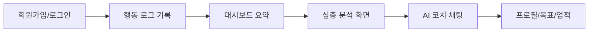

# Mindflow (Mini_ChatBot)

> **행동 로그 × 감정 패턴 분석 × AI 피드백 코치**  
> FastAPI + React 기반으로 개인 행동 데이터를 기록하고, 패턴을 시각화하고, AI 코칭까지 연결한 풀스택 프로젝트


---

## 한눈에 보기

| 항목 | 내용 |
| --- | --- |
| **프로젝트 성격** | 행동/감정 기록 기반 개인 생산성 분석 서비스 |
| **핵심 사용자 경험** | 기록 → 대시보드/분석 → AI 채팅 코치 → 프로필/목표 추적 |
| **핵심 기술** | FastAPI, SQLAlchemy, JWT 인증, Gemini 연동(옵션), React 19, Recharts |
| **중점 구현** | 라우트 권한 보호, 패턴 분석 엔진, UI 전용 API 계층, 다국어/테마 지원 |
| **운영 모드** | Gemini 키가 없어도 fallback 분석 텍스트로 전체 흐름 동작 |

---

## ⚡ Quick Start

### 1) 저장소 클론

```bash
git clone <your-repo-url>
cd Mini_ChatBot
```

### 2) 백엔드 실행

```bash
python -m venv .venv
source .venv/bin/activate  # Windows: .venv\Scripts\activate
pip install -r backend/requirements.txt
uvicorn backend.main:app --reload --port 8000
```

### 3) 프론트엔드 실행

```bash
cd frontend
npm install
npm run dev
```

### 4) 접속

- Frontend: `http://127.0.0.1:5173`
- Backend API: `http://127.0.0.1:8000`
- Swagger: `http://127.0.0.1:8000/docs`

---

## 📂 프로젝트 구조

```text
Mini_ChatBot/
├─ backend/
│  ├─ routers/              # auth, behaviors, analysis, ui, users
│  ├─ services/             # 분석 엔진, AI 피드백 생성
│  ├─ models/               # SQLAlchemy ORM 모델
│  ├─ schemas/              # 요청/응답 Pydantic 스키마
│  ├─ main.py               # FastAPI 엔트리
│  ├─ config.py             # 환경 변수 및 설정
│  └─ database.py           # DB 연결/세션 설정
├─ frontend/
│  ├─ src/pages/            # 화면 단위 컴포넌트
│  ├─ src/components/       # 재사용 UI/차트
│  ├─ src/api/api.js        # Axios 클라이언트
│  ├─ src/hooks/            # 앱 부트스트랩/라우트 관련 훅
│  └─ src/context/          # 언어/테마/메시지 컨텍스트
└─ README.md
```

---

## 핵심 사용자 흐름



### 페이지별 역할

- **Auth**: 이메일/아이디 기반 가입/로그인 + JWT 발급
- **Log**: 카테고리, 감정, 시간 포함 행동 기록 생성
- **Dashboard**: 주간 핵심 카드 + 타임라인 + 감정 추이 + 최근 활동
- **Analysis**: 분포/레이더/추천 액션 중심 심층 분석
- **Chat**: 분석 기반 질의응답형 코칭
- **Profile**: 활동 통계, 주간 목표, 업적 시각화

---

## 🏗️ 아키텍처 요약

### 레이어 구성

| 레이어 | 구현 |
| --- | --- |
| **Frontend** | React Router 기반 멀티페이지, Axios API 클라이언트, Recharts 시각화 |
| **Backend API** | FastAPI 라우터 분리(`auth`, `behaviors`, `analysis`, `ui`, `users`) |
| **Domain Model** | `User`, `BehaviorLog` 중심의 관계형 모델 |
| **Analysis Engine** | 감정 비율/강도 평균/트렌드/리스크 패턴 계산 |
| **AI Layer** | Gemini 호출 + 실패/미설정 대비 fallback 생성 |
| **Auth/Security** | JWT Bearer 인증, 사용자 본인 데이터 접근 제한 |

### 왜 `/api/ui` 계층이 중요한가?

도메인 API만으로 화면을 구성하면 프론트에서 여러 응답을 조합하는 비용이 커집니다. 이 프로젝트는 `/api/ui`를 통해 화면 목적에 맞는 ViewModel을 제공해서:

1. 프론트 데이터 조립 코드를 줄이고,
2. 페이지 렌더링 안정성을 올리고,
3. 백엔드에서 데이터 형식을 통제하기 쉽게 만들었습니다.

---

## 🔐 인증/권한 모델

- JWT(`HS256`) 기반 인증
- 로그인/회원가입 시 토큰 발급 후 프론트 localStorage에 저장
- 요청 인터셉터에서 `Authorization: Bearer <token>` 자동 주입
- `require_same_user` 검증으로 path `user_id`와 토큰 주체 불일치 시 차단(403)

---

## 🧠 분석 엔진 디테일

`PatternAnalysisService`는 행동 로그를 기반으로 아래 정보를 계산합니다.

1. **BehaviorPattern**
   - 감정별 빈도
   - 전체 대비 비율
   - 평균 강도
2. **EmotionalTrend**
   - 감정 강도의 증가/감소/안정 추세
3. **RiskyPattern**
   - 부정 감정 고빈도 + 고강도 조합
   - 짧은 간격 내 강도 급변
   - 특정 위험 태그 감지(`self_harm` 등)

분석 결과는 대시보드/분석 페이지와 AI 채팅의 컨텍스트로 재활용됩니다.

---

## 🤖 AI 피드백 전략

- `GOOGLE_API_KEY`가 설정된 경우 Gemini 모델 호출
- 키가 없거나 API 실패 시 fallback 피드백 자동 생성
- 즉, **AI 연동 없이도 서비스의 핵심 UX(기록→분석→피드백)가 동작**

운영 관점에서 이는 데모/개발/네트워크 장애 상황에서 강력한 안정장치입니다.

---

## 🌐 API 요약

| 영역 | Method | Endpoint | 설명 |
| --- | --- | --- | --- |
| Auth | POST | `/api/auth/signup` | 회원가입 + 토큰 발급 |
| Auth | POST | `/api/auth/login` | 로그인 + 토큰 발급 |
| Auth | GET | `/api/auth/me` | 현재 사용자 조회 |
| Behaviors | POST | `/api/behaviors/{user_id}` | 로그 생성 |
| Behaviors | GET | `/api/behaviors/{user_id}` | 로그 목록 조회 |
| Behaviors | PUT | `/api/behaviors/{user_id}/{log_id}` | 로그 수정 |
| Behaviors | DELETE | `/api/behaviors/{user_id}/{log_id}` | 로그 삭제 |
| Analysis | POST | `/api/analysis/{user_id}` | N일 분석 + AI 피드백 |
| UI | GET | `/api/ui/{user_id}/overview` | 대시보드 데이터 |
| UI | GET | `/api/ui/{user_id}/analysis` | 분석 페이지 데이터 |
| UI | GET | `/api/ui/{user_id}/profile` | 프로필 데이터 |
| UI | GET | `/api/ui/{user_id}/chat/bootstrap` | 채팅 초기 데이터 |
| UI | POST | `/api/ui/{user_id}/chat` | 채팅 질의 응답 |

---

## ⚙️ 환경 변수

백엔드 실행 전 아래 변수들을 설정할 수 있습니다.

```bash
# 필수 권장
SECRET_KEY=your-secret-key
ALGORITHM=HS256
ACCESS_TOKEN_EXPIRE_MINUTES=60

# DB (미설정 시 SQLite 사용)
DATABASE_URL=sqlite:///./mini_chatbot.db

# AI 연동 (선택)
GOOGLE_API_KEY=your-google-api-key
GEMINI_MODEL=gemini-1.5-flash
```

> `DATABASE_URL`이 MySQL로 설정되어도 연결 실패 시 SQLite fallback으로 동작하도록 설계되어 있습니다.

---

## 🐳 Docker 실행 (선택)

```bash
docker compose up --build
```

- 환경에 따라 백엔드/프론트 포트 매핑은 `docker-compose.yml`을 확인해 주세요.

---

## 🧩 트러블슈팅

### 1) `401 Unauthorized`

- 토큰 만료/누락 가능성이 큽니다.
- 브라우저 localStorage의 토큰을 제거하고 다시 로그인해 보세요.

### 2) `403 Forbidden`

- 요청의 `user_id`와 토큰 사용자 불일치일 가능성이 큽니다.
- URL 파라미터와 로그인 계정을 함께 확인해 주세요.

### 3) AI 응답이 일반 텍스트로만 보임

- `GOOGLE_API_KEY` 미설정 또는 Gemini 호출 실패 상황일 수 있습니다.
- fallback 모드는 정상 동작이며, 키 설정 시 고급 응답을 받을 수 있습니다.

### 4) CORS 오류

- 프론트(`5173`)와 백엔드(`8000`) 주소가 다를 때 발생할 수 있습니다.
- 백엔드 CORS 설정 및 실제 접속 URL을 일치시켜 주세요.

---

## 🚀 향후 개선 아이디어

- 행동 로그 검색/필터(기간, 감정, 태그)
- 분석 리포트 PDF 내보내기
- 팀/코치 공유 링크 모드
- 실시간 알림(일일 리마인더, 주간 리포트)
- 테스트 자동화(backend pytest + frontend vitest/e2e)

---

## 📄 License

MIT (원하시는 라이선스로 변경 가능)
